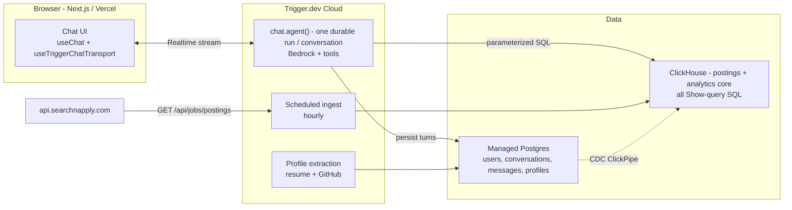

# Job.Chat

Job.Chat is a chat agent over live job-market data, built for the ClickHouse x Trigger.dev Virtual
Summer Hackathon 2026 ("Beyond the Wall of Text"). Ask it anything about the market and the answer
is one insight card - a one-line verdict plus an interactive chart or table, with "Show query"
revealing the exact ClickHouse SQL - never a wall of text. Signed-in users can drop in a resume to
get a structured profile (enriched with public GitHub signals) matched against live postings. Live
at jobchat.dev.

## Demo

Live: https://jobchat.dev

Judge env file: https://drive.google.com/file/d/1T6Ejk0_y0x37l636en4NlBoYtz7SoHxQ/view?usp=sharing

<!-- HERO SCREENSHOT SLOT - operator adds the hero screenshot here during the demo walk -->

<!-- DEMO VIDEO SLOT - operator adds the 5-minute demo video link here during the demo walk -->

## What was built

- **Insight cards, not paragraphs** - every data answer is a one-line verdict plus an interactive
  Recharts chart (bars, trend, donut, histogram) or a table; "Show query" reveals the exact executed
  ClickHouse SQL.
- **Analytics catalog** - six fixed ClickHouse query templates plus a schema-validated
  composed-query builder (whitelisted measures/dimensions/filters) that answers anything else the
  postings columns can express; no free-form or generative SQL.
- **Durable chat agent** - one Trigger.dev `chat.agent()` run per conversation orchestrates Bedrock
  and the ClickHouse tool catalog, streaming structured data parts to the UI in real time.
- **Data-aware agent** - each conversation is grounded in a live corpus note (row count, snapshot
  date, source mix, and the categorical values actually present), and every categorical filter matches
  case-insensitively - so the agent answers from what the data really holds instead of guessing.
- **Guardrails in the run** - per-caller message caps, a daily budget, and turn/step ceilings are
  enforced inside the agent run itself.
- **Guests and accounts** - guests chat with no sign-in; signing in (Google via Better Auth) adopts
  the guest's conversations, adds cross-device sidebar history (rename or delete any conversation),
  and raises the message cap.
- **Resume profiles** - a signed-in user uploads a resume PDF and a durable Trigger.dev task extracts
  a schema-validated structured profile (Bedrock). The profile is editable: salary and location
  preferences feed the next match run, skill chips add/remove, and the whole profile can be deleted.
- **GitHub enrichment** - the extraction folds in public GitHub signals (languages, topics, repos,
  merged-PR count); deeper with a read-only PAT, gracefully capped without one.
- **Fit matching** - fit-intent questions route by identity: guest -> sign-in invite,
  signed-in-without-profile -> profile invite, profile-on-file -> `search_postings` ranks live
  postings against the profile.
- **Scheduled ingestion** - a Trigger.dev cron task pulls postings from the searchnapply REST API
  into ClickHouse hourly.

## Tech stack

| Layer | Choice |
|---|---|
| Runtime | Bun |
| Framework | Next.js 16 (App Router), React 19; deployed on Vercel |
| Agent | Trigger.dev `chat.agent()` - durable runs, Realtime streaming |
| OLAP database | ClickHouse Cloud - `postings` + every analytical read |
| OLTP database | ClickHouse Managed Postgres - users, conversations, messages, profiles |
| LLM | Claude via AWS Bedrock - Sonnet 4.5 (chat + profile extraction) |
| Auth | Better Auth (Google OAuth) |
| Charts | Recharts |
| Validation | Zod |
| Tests | Vitest (unit + integration), Playwright (e2e), Bedrock eval harness |

## Architecture

How the entry maps to the rubric:

- **ClickHouse depth** - `postings` is the OLAP core (ReplacingMergeTree with dedup-correct FINAL
  reads); every analytical read is parameterized SQL through the analytics catalog, categorical
  filters match case-insensitively, and each conversation carries a live corpus note so answers stay
  grounded in the real data - and every card's "Show query" reveals the exact executed ClickHouse SQL.
- **Trigger.dev depth** - `chat.agent()` IS the product: one durable run per conversation
  orchestrates Bedrock and the tool catalog and streams structured data parts to the UI via Trigger
  Realtime. Resume profile extraction and scheduled ingestion are Trigger tasks too.
- **OLTP + OLAP bonus path** - ClickHouse Managed Postgres (transactional: `users`, `conversations`,
  `messages`, `profiles`) runs alongside ClickHouse (analytics), with the `users` table mirrored into
  ClickHouse via the built-in CDC ClickPipe.



- **Trigger.dev** (`trigger/`): the `chat.agent()` conversation loop (Bedrock, catalog tools,
  turn/step ceilings, guard backstop, persistence), the durable resume-to-profile extraction task
  (with GitHub enrichment), and the scheduled postings ingestion task.
- **ClickHouse** is the primary database: the `postings` table (ReplacingMergeTree) and every
  analytical read behind every chart, via `shared/analytics.ts` (read-only `jobchat_ro` user) -
  six fixed query templates plus a schema-validated composed-query builder (whitelisted
  measures/dimensions/filters) for anything else the postings columns can answer - no
  free-form/generative SQL either way.
- **ClickHouse Managed Postgres** holds transactional state - `users`, `conversations`, `messages`,
  `profiles` (`migrations/*.sql`). The `users` table is mirrored into ClickHouse via the built-in
  CDC ClickPipe; `postings` is the OLAP core (the OLTP + OLAP pairing).
- **Auth** (`src/lib/auth.ts`): Better Auth with Google OAuth. Guests chat with no account; signing
  in adopts any guest conversations into the account (sidebar history, any device) and raises the
  per-user message cap.
- **LLM**: Claude via AWS Bedrock (`@ai-sdk/amazon-bedrock`, `eu.` inference profile) - Sonnet 4.5
  for both the chat agent and profile extraction (the extraction task imports the same `MODEL_ID`).

### About the searchnapply API

**`api.searchnapply.com`** is a pre-existing, independent job-search API operated by this
team. Job.Chat consumes it strictly as an **external data source** - the origin of the job
postings that a scheduled Trigger.dev task ingests into ClickHouse (authenticate for a
bearer token, then page `GET /api/jobs/postings`). None of the searchnapply service's code
is part of this repository or this submission; everything here was built during the
hackathon window.

## Repo map

| Path | What lives here |
|---|---|
| `src/` | The Next.js app - UI components (chat, insight cards, charts, landing), server actions, and `src/lib` (auth, chat transport, formatting). |
| `shared/` | Framework-agnostic core shared by the app and the tasks - the ClickHouse analytics catalog, clients, ingestion, and the insight/profile types. |
| `trigger/` | Trigger.dev tasks - the `chat.agent()` loop with its tools/prompt/guards, resume profile extraction + GitHub enrichment, and scheduled ingestion. |
| `tests/` | Vitest unit + integration, Playwright e2e, fixtures, and the Bedrock eval harness (`tests/evals/`). |
| `migrations/` | Postgres DDL (`migrations/*.sql`) and ClickHouse DDL (`migrations/clickhouse/*.sql`). |
| `scripts/` | Migration runners (`ch:migrate`, `pg:migrate`). |

## Hackathon

Built for the **ClickHouse x Trigger.dev Virtual Summer Hackathon 2026**. The brief, "Beyond the
Wall of Text", asks for a chat agent whose response is the product - visual, interactive, explorable
- judged on the ratio of insight to words ("text is the garnish, not the meal"). Job.Chat answers
every market question with a verdict-plus-chart insight card, never a paragraph.

## Run it

```bash
bun install
cp .env.example .env        # fill in your values (ClickHouse, Postgres, AWS Bedrock, searchnapply,
                             # Better Auth secret + Google OAuth client - Google is optional; without
                             # it, sign-in is unavailable but guests can still chat)
bun run ch:migrate           # ClickHouse DDL (migrations/clickhouse/*.sql)
bun run pg:migrate           # Postgres DDL (migrations/*.sql)
bunx trigger.dev@latest dev  # Trigger.dev tasks (local dev, needs a project ref + login)
bun run dev                  # Next.js app
```

`bun run build` produces the production build.

### For judges

A low-privilege judge `.env` (a read-only ClickHouse user, a judge-only Postgres database, and blank
optional keys) is provided as a Google Drive file linked from the submission form - never committed
to this repo. Save it as `.env`. The ClickHouse corpus and the judge Postgres database are already
provisioned, so skip the two `*:migrate` steps:

```bash
bun install
# Create your own free Trigger.dev project. In the judge .env, paste that project's dev secret key into
# the blank TRIGGER_SECRET_KEY, and set the project's ref as the `project` field in trigger.config.ts.
bunx trigger.dev@latest dev  # chat.agent() runs in YOUR Trigger project
bun run dev                  # http://localhost:3000
```

`chat.agent()` runs execute in Trigger's cloud against the project named in `trigger.config.ts`, so
the chat path needs a Trigger project you own: create a free one, paste its dev `TRIGGER_SECRET_KEY`
into the blank var in the judge `.env`, and set the `project` ref before running `bun run dev`.

## Checks

```bash
bun run lint
bun run typecheck
bun run test        # vitest (unit + integration; integration needs live ClickHouse/Postgres/searchnapply creds)
bun run test:e2e    # playwright (builds + runs the app with network mocks - no cloud services)
```

## Eval harness (dev only)

`JOBCHAT_EVAL=1 bun run eval` drives the real prompt + Bedrock through the 40-case fixture set,
scoring tool choice, mode, chart type, and format conformance. Flag-gated (`JOBCHAT_EVAL=1` +
Bedrock env) and never run in CI - it costs real model credits, so it's an on-demand dev check, not
a build gate.

## License

MIT — see [LICENSE](LICENSE).
